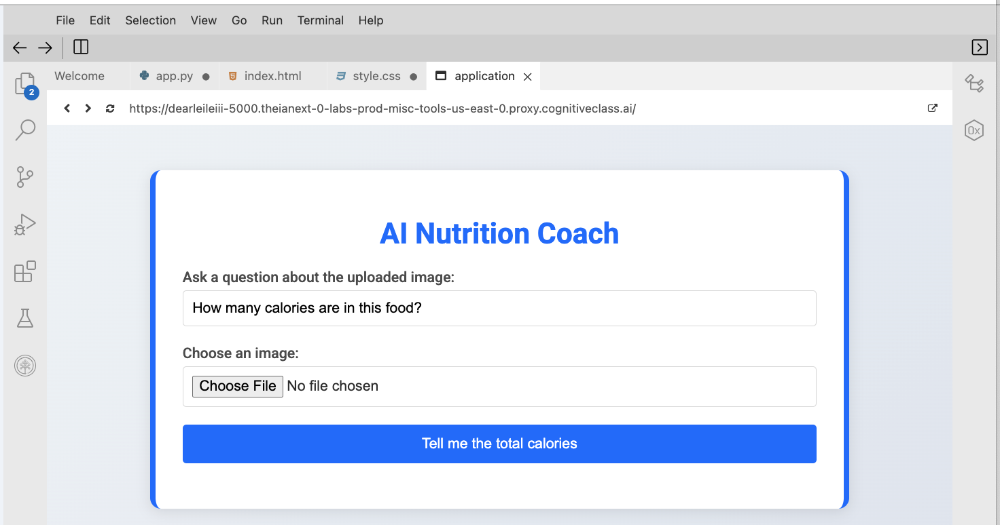
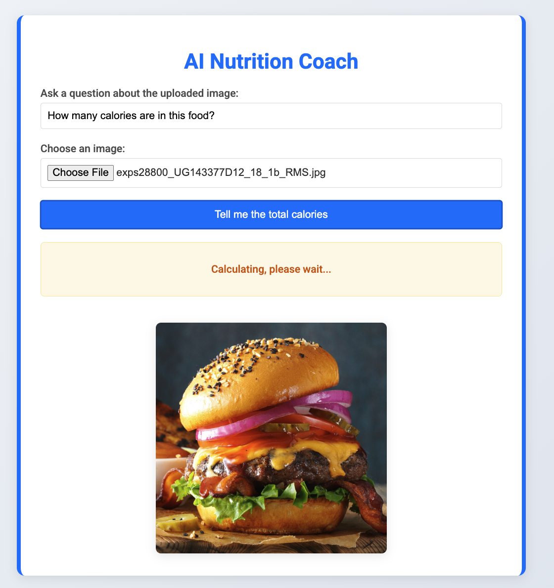

## AI Nutrition Coach
The AI Nutrition Coach app empowers users with the ability to make informed dietary choices using advanced AI technology. This app leverages the **Llama 4 Maverick 17B 128E Instruct FP8 model** or **IBM Granite 3.2 Vision** to analyze food images and provide valuable nutritional information. Here's a breakdown of the app's key features:

1. Food identification and calorie estimation

2. Nutritional breakdown

3. Personalized nutritional advice

#### Install the library and packages
```
pip install ibm-watsonx-ai==1.1.20 image==1.5.33 flask requests==2.32.0
```

### Function purpose

The index function serves as the main route ("/") for the web app. It processes both GET and POST requests and handles the following tasks:

**Retrieves user inputs** such as an image file and a user query.
**Processes the uploaded image** by encoding it into a base64 format.
**Generates a response** using an AI model based on a carefully crafted prompt for nutritional analysis.
**Displays the output** on a webpage.


