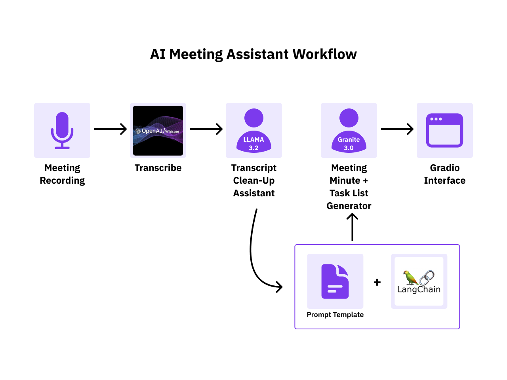
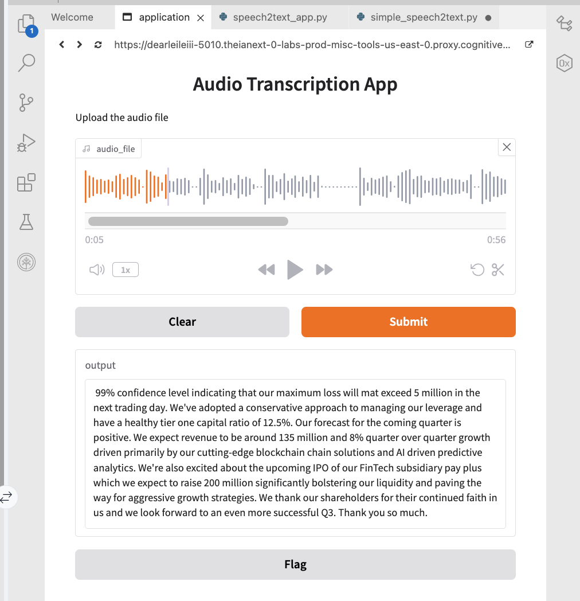
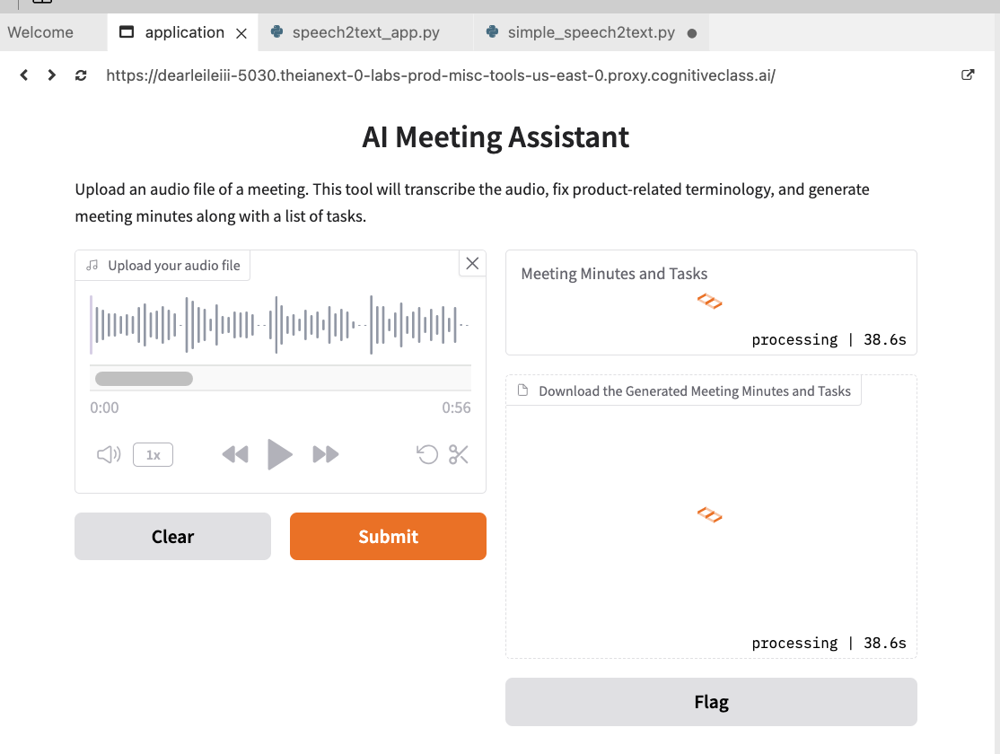

Build an AI Meeting Assistant: Instant Notes, Zero Worries
The AI-Powered Meeting Assistant project offers a modern, transformative solution for meeting documentation. By leveraging large language models (LLMs) and generative AI, this project equips with the tools to automate note-taking and extract critical insights efficiently.

The transcription function that uses the OpenAI Whisper model to convert speech from audio files into text. This function processes audio files uploaded through a Gradio app interface (commonly in .mp3 or .wav format, but other formats may also work). Once the transcription is complete, the resulting text is passed into an LLMChain. The LLMChain integrates the transcribed text with the defined prompt template and forwards it to the chosen LLM (IBM Granite Instruct model).

Finally, the LLM generates a response based on the input and template, and the output is displayed in the Gradio app's output textbox, providing a seamless end-to-end workflow for processing audio inputs and generating structured meeting minutes and tasklist in text format available for download. The tasklist provides actionable insights derived from the transcript, including additional information not explicitly stated in it. The LLM will help identify the next steps to take, and the user will then assess whether these tasks are feasible.




In our application, we used ibm/granite-3-8b-instruct as the primary LLM to generate meeting summaries and task lists, try replacing it with meta-llama/llama-4-maverick-17b-128e-instruct-fp8 and compare their performance to see how the outputs differ!

Complete app, run: 

```
python speech_analyzer.py
```


## Setting up your development environment

#### Preparing the environment
1. Start setting up the environment by creating a Python virtual environment and installing the required libraries. Use the following commands in the terminal:

```
pip3 install virtualenv 
virtualenv my_env # create a virtual environment my_env
source my_env/bin/activate # activate my_env
```

2. Install the required libraries in the environment (NOTE: This will take several minutes. Please be patient. You can go grab a quick coffee and come back!).

```
# installing required libraries in my_env

pip install transformers==4.35.2 \
torch==2.1.1 \
gradio==5.9.0 \
langchain==0.3.12 \
langchain-community==0.3.12 \
langchain_ibm==0.3.5 \
ibm-watsonx-ai==1.1.16 \
pydantic==2.10.3
```

3. Install ffmpeg so that you can work with audio files in Python. Run this command first to update the package lists for the Advanced Package Tool.

```
sudo apt update
```

4. Then, install ffmpeg.
```
sudo apt install ffmpeg -y
```


### Step 1. Speech-to-text
Run the Python file to download the sample audio file and place it in our working directory.

```
python3 simple_speech2text.py
```

You should see the downloaded audio file in the file explorer window.

### Step 2: Creating audio transcription app

Create the pipeline with openai/whisper-tiny.en

Start the app by:

```
python3 speech2text_app.py
```

Where you can choose and upload any MP3/WAV audio file from your system.

Upload your audio file then select Submit to get the transcript.



### Step 3. Integrating LLM using IBM watsonx Granite

In simple_llm.py: 

Importing required libraries:
The code begins by importing libraries and modules required for interacting with IBM watsonx foundation models and LangChain:

ModelTypes, DecodingMethods, EmbeddingTypes: For defining model types, decoding methods, and embedding types.
APIClient and Credentials: For managing API interactions and credentials.
GenTextParamsMetaNames: For managing model parameters such as decoding methods, maximum tokens, and temperature.
WatsonxLLM and WatsonxEmbeddings: For interacting with IBM's large language models and embedding features.
PromptTemplate and LLMChain: For defining prompt templates and chaining operations.

```
python3 simple_llm.py
```

